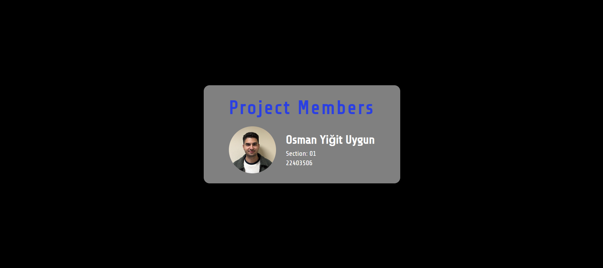
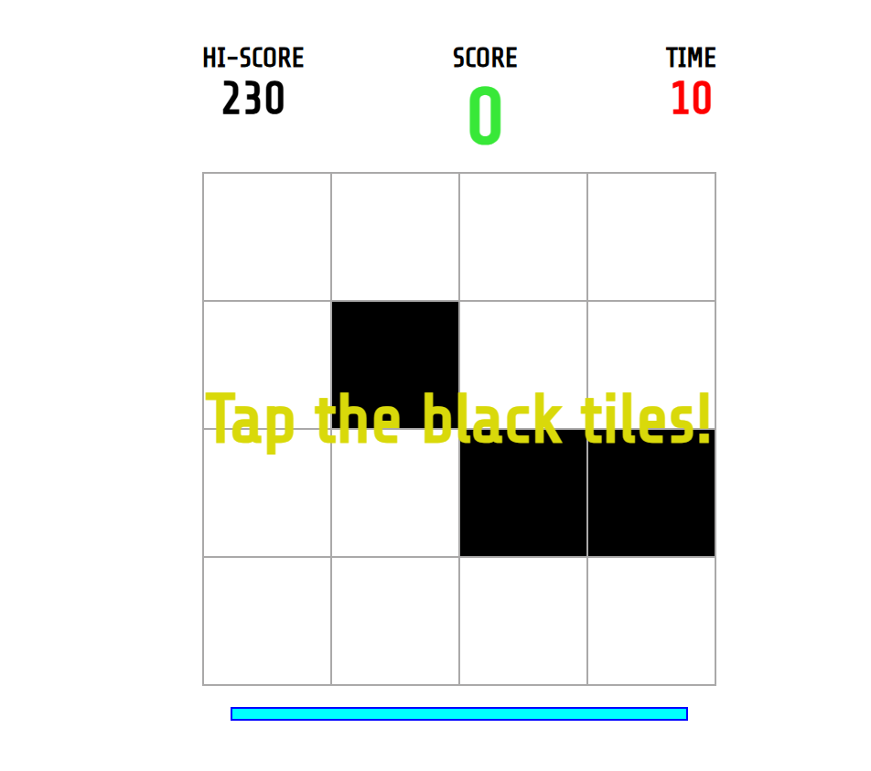
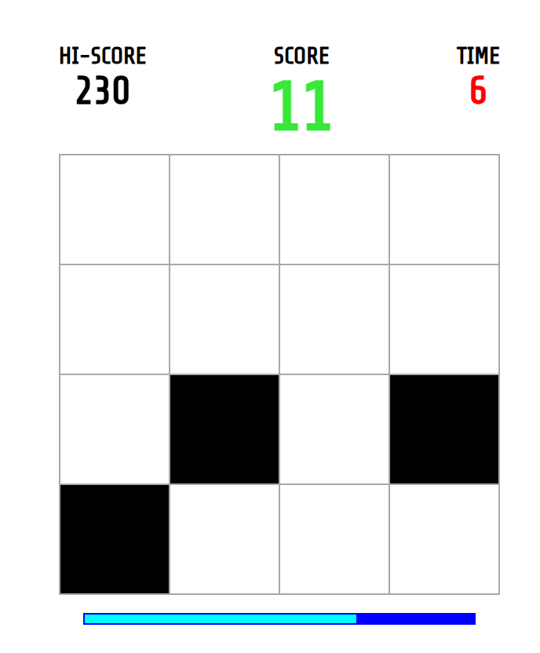
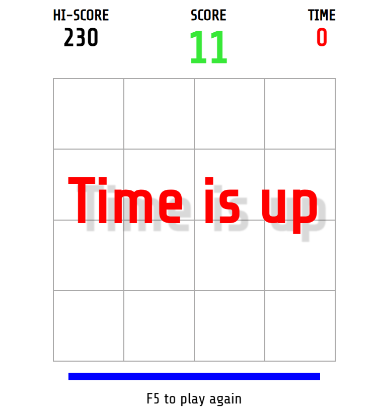
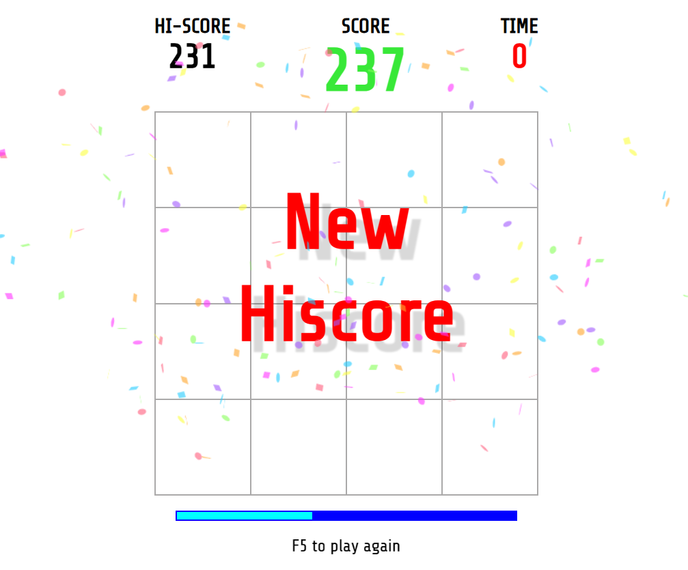

# CTIS 255 - Frontend Web Technologies Term Project

## Project Description
A game using HTML, CSS, JavaScript, and DOM API.  Detailed description in pdf file.

## Technologies Used
- HTML5
- CSS3
- JavaScript

## Project Structure
```
/
├── html/
│   └── game.html
├── css/
│   └── style.css
├── js/
│   └── hiscore.js
├── img/
├── sample_images/
└── README.md
```

## Game Images
### Game Start Screen


### In-Game Screen





## Author
- Student:  Osman Yiğit Uygun
- Course: CTIS 255 - Frontend Web Technologies

## Setup Instructions
1. Clone the repository
2. Open `game.html` in your browser
3. Enjoy the game!